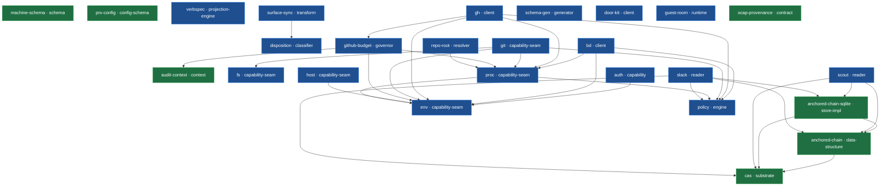

# Bounded Systems

**Keeping AI agents honest when they build and ship software.**

Agents are increasingly trusted to write and ship real code. The moment you let
them, the bottleneck stops being "can the agent do the task" and becomes "can
you trust what it did" — across many changes, many tools, and many
agent-authored components that all have to stay consistent as they evolve.

Bounded Systems builds that machinery: software *delivered by agents but
governed like infrastructure*. An agent's git-writes are signed and attributable to their owner today — egress and external reads next — and
every change moves through one content-addressed, auditable pipeline to a
merged PR. Most tooling secures a single action — the harder, unsolved problem
is enforcement *between* components, keeping a growing set of agent-authored
contracts honest against each other.

We hold our own claims to that same bar. Every one on this page is graded
against the running code — *Enforced*, *Partial*, or *Aspirational* — by an
instrument built to catch our **own** over-statements and file the gap. Docs
generate from source and fail CI on drift; guest-room's specs execute against
its engine. We keep ourselves as honest as we keep the agents.

The capability model lives in two codebases: **guest-room** is the flagship —
the model as a single, readable, spec-tested library — and **prx** runs it at
full scale on a stack of small, single-responsibility capability libraries, one
for each kind of system authority (filesystem, network, env, subprocess).

## Start here

### [`guest-room`](https://github.com/bounded-systems/guest-room) — the flagship: the model in one library

A guest-agnostic capability runtime built on **rooms and doors**. A *door* is a
single unit of authority: you hold a socket to a brokered service, never the
keys behind it. A *room* is a named bundle of doors, and authority can only ever
be narrowed as it is handed onward, never widened. Its behavior specs execute
against the engine, so the docs cannot drift from the code. Read this to see the
capability model made physical.

### [`prx`](https://github.com/bounded-systems/prx) — the model, at full scale

The agent-run **work-unit CLI** — a work unit is one scoped task an agent owns
end-to-end. Capability-scoped agents — git-writes signed and attributable to their owner —
driving each work unit through one content-addressed, auditable pipeline to a
merged PR. The `@bounded-systems/*` libraries below each live in their own repo
and publish to JSR; `prx` consumes them as published dependencies.

## The `@bounded-systems/*` libraries

Each is a narrow capability seam — the one sanctioned access point for one kind
of ambient system power — so that effects stay attributable and policy stays
enforceable.

| Package | What it is |
|---|---|
| `anchored-chain` | Derivation chain with contract validation, signing, lineage tracking, and invalidation |
| `anchored-chain-sqlite` | SQLite/Drizzle-backed implementation of the anchored-chain stores |
| `audit-context` | Ambient runtime context for gh-call audit attribution |
| `auth` | Service-credential resolver (GitHub, Notion) through a single sanctioned access point |
| `bd` | Typed interface to the beads CLI with policy enforcement |
| `cas` | Content-addressable storage: bytes addressed by their SHA-256 digest |
| `disposition` | Pure classifier mapping work-unit state to a disposition (ok/prune/repair/review) |
| `env` | The one sanctioned reader of `process.env` |
| `fs` | Filesystem capability seam — the one allowed filesystem-access point |
| `gh` | GitHub CLI wrapper with policy enforcement and budget audit logging |
| `git` | Git CLI wrapper with policy enforcement and stale-lock recovery |
| `github-budget` | Rate-limit-aware gh wrapper with bucket classification and audit trail |
| `host` | The one sanctioned reader of host/OS ambient state |
| `machine-schema` | Brands, handoff envelope, and state/phase primitives for work-unit machines |
| `policy` | Tool-policy engine enforcing subcommand allowlists by tool, state, and role |
| `proc` | The one allowed subprocess spawn point |
| `repo-root` | Repo-root resolution capability |
| `scout` | Content-addressed surface reads with anchored-chain provenance |
| `slack` | Policy-gated, provenance-tracked Slack read surface |
| `surface-sync` | Type ontology for work-unit change-detection across GH/branch/worktree/tmux/beads |

## Beyond the seams

Not every `@bounded-systems/*` package is a capability seam:

- **[`verbspec`](https://jsr.io/@bounded-systems/verbspec)** — spec-driven CLI
  core: author a verb once as a typed `VerbSpec`, then project it to CLI, MCP,
  OpenAPI, and Anthropic tool surfaces. One source, many surfaces.
- **[`prx-config`](https://jsr.io/@bounded-systems/prx-config)** — TUI
  configuration schema parser/emitter for the L1/L2 tools.

## The doors & the box

A *door* made real: a brokered capability an agent acts through, holding a socket
to a service rather than the keys behind it. `claude-box` is the box; its
authority is exactly the door references it holds.

| Repo | What it is |
|---|---|
| [`claude-box`](https://github.com/bounded-systems/claude-box) | A capability-secured box for agent sessions — authority is the door references it holds, parent-agnostic |
| [`door-kit`](https://github.com/bounded-systems/door-kit) | In-box door-client SDK over the guest-room protocol |
| [`door-keeper`](https://github.com/bounded-systems/door-keeper) | `keeperd` — the git-signing capability door (pinned OCI image) |
| [`door-scout`](https://github.com/bounded-systems/door-scout) | `scoutd` — the external-read capability door |
| [`door-concierge`](https://github.com/bounded-systems/door-concierge) | `concierged` — the capability-introducer door |
| [`door-net`](https://github.com/bounded-systems/door-net) | `netd` — the allowlist-egress capability door |
| [`door-peercred`](https://github.com/bounded-systems/door-peercred) | `SO_PEERCRED` launcherd helper (Rust) |

## Provenance & substrate

| Repo | What it is |
|---|---|
| [`ocap-provenance`](https://github.com/bounded-systems/ocap-provenance) | Capability-use provenance — a schema + SLSA mapping binding each privileged effect to a signed owner and an auditable chain |
| [`dev-registry`](https://github.com/bounded-systems/dev-registry) | Local-first, OCI-compatible registry + devcontainer build system, with build traceability |
| [`facilities`](https://github.com/bounded-systems/facilities) | Nix facilities — shared flakes, devshells, and build substrate |

## Contracts beyond authority — design & semantics

The same discipline — draw a boundary, verify at it, let typed proof flow across —
applied past *system authority* to what actually ships.

| Repo | What it is |
|---|---|
| [`brand`](https://github.com/bounded-systems/brand) | The design system as contracts — W3C tokens + build-time gates (no hardcoded values/copy, complete meta, WCAG-AA contrast) |
| [`lone`](https://github.com/bounded-systems/lone) | Runtime semantic boundary — an untrusted DOM subtree becomes a typed `Blessed<T>` or a deterministic `Finding[]` |
| [`site`](https://github.com/bounded-systems/site) | [bounded.tools](https://bounded.tools) — the static site, built on `@bounded-systems/brand` |

## The libraries, as a knowledge graph
<!-- registry-graph:start · generated by scripts/gen-registry-graph.mjs from bounded-systems/site/data/registry.json — do not edit by hand -->

Every `@bounded-systems/*` library is a typed node: a **verb** (a capability that acts) or a **noun** (data that flows), declared in its own `package.json`. An arrow `A → B` means A's contract consumes B's. Generated from [each package's `bounded.*`](https://github.com/bounded-systems/site/blob/main/data/registry.json) and drift-checked in CI — *19 verbs (capabilities) · 7 nouns (data) · 30 typed edges.*

<!-- registry-graph:end -->

## Links

- 🌐 [bounded.tools](http://bounded.tools)
- 📦 [`prx` on GitHub](https://github.com/bounded-systems/prx)
- 🚪 [`guest-room` on GitHub](https://github.com/bounded-systems/guest-room)

> prx, guest-room, and the libraries are source-available under
> [PolyForm Noncommercial 1.0.0](https://polyformproject.org/licenses/noncommercial/1.0.0/).
